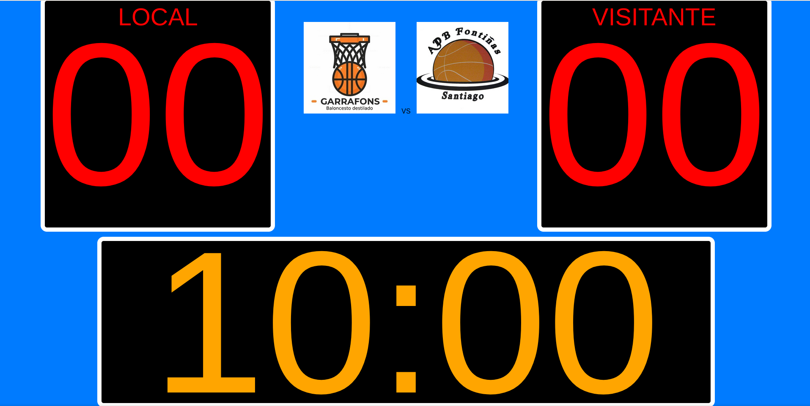

# Basketball Scoreboard

Marcador de baloncesto simple con cronómetro. 

Se puede utilizar directamente en el siguiente enlace:

[https://jpenalta.github.io/scoreboard/](https://jpenalta.github.io/scoreboard/ "ScoreBoard")

## Funcionamiento
Moviendo el cursor a la parte inferior de la pantalla aparece una barra con botones que permiten:

* **+1 Local**  y **-1 Local**: aumentar y disminuir el valor del marcador local.
* **+1 Visitante**  y **-1 Visitante**: aumentar y disminuir el valor del marcador local.
* **Iniciar Cronómetro** y **Parar Cronómetro** : arrancar y parar el cronómetro.
* **Fijar Cronómetro**: modificar el valor del cronómetro al valor que se desee.

Es posible controlar el marcador desde el **teclado** con las siguientes teclas:

* **a** : aumentar el marcador local
* **s** : disminuir el marcador local
* **k** : aumentar el marcador visitante
* **l** : disminuir el marcador visitante
* **espacio**: arrancar y parar el cronómetro

## Logos e imagen de fondo
Por defecto muestra como logos de los equipos dos imagenes, 'local.jpg' y 'visitante.jpg', que están en la carpeta *img*. 

Es posible indicar por parámetros de la url las imagenes a utilizar, para ello se utilizan los parámetros **localLogoUrl** y **visitanteLogoUrl**.

La siguiente url intercambia los logos por defecto:

[https://jpenalta.github.io/scoreboard/?visitanteLogoUrl=https://raw.githubusercontent.com/jpenalta/scoreboard/main/img/local.jpg&localLogoUrl=https://raw.githubusercontent.com/jpenalta/scoreboard/main/img/visitante.jpg](https://jpenalta.github.io/scoreboard/?visitanteLogoUrl=https://raw.githubusercontent.com/jpenalta/scoreboard/main/img/local.jpg&localLogoUrl=https://raw.githubusercontent.com/jpenalta/scoreboard/main/img/visitante.jpg)

También es posible indicar una imagen de fondo pasando como parámetro **backgroundImageUrl**. La siguiente url fija como fondo una imagen de pixabay:

[https://jpenalta.github.io/scoreboard/?backgroundImageUrl=https://cdn.pixabay.com/photo/2017/08/07/22/24/hobbies-2608561_960_720.jpg](https://jpenalta.github.io/scoreboard/?backgroundImageUrl=https://cdn.pixabay.com/photo/2017/08/07/22/24/hobbies-2608561_960_720.jpg)
